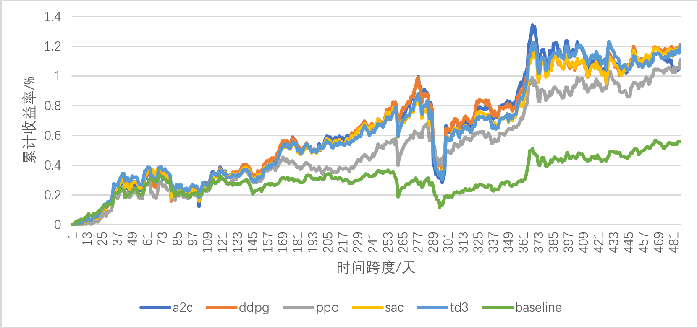
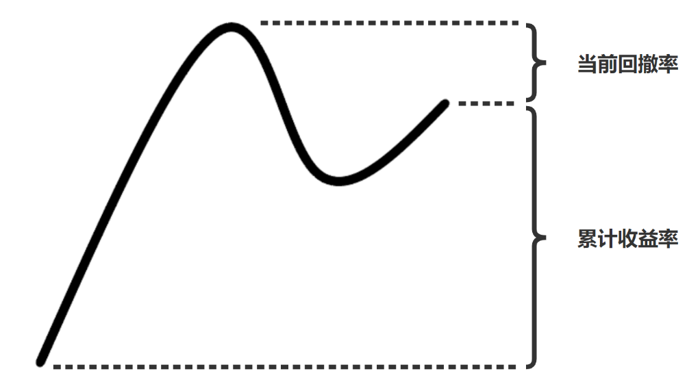

# 强化学习交易股票
在A股市场上，对五个深度强化学习算法进行测试，找到比较合适的深度强化学习智能体

## 回测结果

回测结果展示（时间跨度为2019年1月1日至2021年1月1日）



回测结果分析表（时间跨度为2019年1月1日至2021年1月1日，baseline 为上证50指数）

|  性能评价指标  | 上证 50 指数 |   A2C   |  DDPG   |   PPO   |   SAC   |   TD3   |
| :------------: | :----------: | :-----: | :-----: | :-----: | :-----: | :-----: |
| **累计收益率** |    58.98%    | 108.49% | 121.26% | 110.85% | 120.61% | 120.14% |
| **最大回撤率** |   -18.22%    | -35.83% | -31.45% | -16.75% | -29.24% | -30.69% |
| **Omega比率**  |     1.29     |  1.31   |  1.34   |  1.36   |  1.35   |  1.35   |
| **Sharpe比率** |     1.37     |  1.23   |  1.50   |  1.72   |  1.54   |  1.52   |
| **年化收益率** |    27.11%    | 46.37%  | 50.95%  | 47.23%  | 50.72%  | 50.55%  |
| **年化波动率** |    18.90%    | 36.25%  | 30.78%  | 24.28%  | 29.48%  | 29.89%  |

更加详细的回测结果可以查看 [./plot_traded_result.ipynb](./plot_traded_result.ipynb)

## 快速开始

在终端中输入

```shell
git clone https://github.com/sunnyswag/RL_in_Stock.git
git pip install -r requirements.txt
```

进入 [./learn](./learn) 文件夹查看详细步骤

## 环境设计思路

**state_space 由三部分组成 :** 

1. 当前的现金

3. 每只股票的持仓量

4. 股票数 * 环境因素（总计15个）


**reward 的计算方式：**

* Reward = 累计收益率 - 当前回撤率

  

**action_space 的空间：**

* actions ∈ [-x, x]

* 正数表示买入，负数表示卖出，0 表示不进行买入卖出操作


## Reference

[FinRL](https://github.com/AI4Finance-LLC/FinRL)
