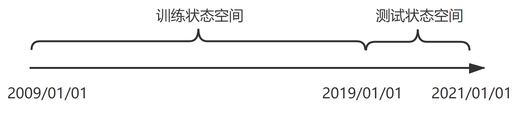

## 下载数据

在终端中输入

```shell
python ./data.py
```

数据保存在 `./data_file` 文件夹中

数据分为训练状态空间和测试状态空间，默认拆分方式为：



## 训练

在终端中输入

```shell
mkdir nohup
nohup python -u ./trainer.py -m 'a2c' -tts 200000 >./nohup/A2C.log 2>&1 &
```

**TIPS**：

* 若未下载数据，运行 `./trainer.py` 将自动下载
* 可运行 [./start_train.sh](./start_train.sh) 批量化操作
* 运行日志保存在 `./nohup` 文件夹中
* 运行完成后的模型保存在 `./train_file` 文件夹中
* 推荐使用 [matpool](https://www.matpool.com/register) 下的 `FinRL` 镜像运行(需要的朋友可以填个邀请码`07NmxxrF2i9zWL6`）

## 回测

在终端中输入

```shell
python -u ./trader.py -m 'a2c'
```

**TIPS**：

* 若未找到 `.model` 文件，可以在 [release](https://github.com/sunnyswag/RL_in_Stock/releases/) 中进行下载
* 回测数据保存在 `./trade_file` 文件夹中

